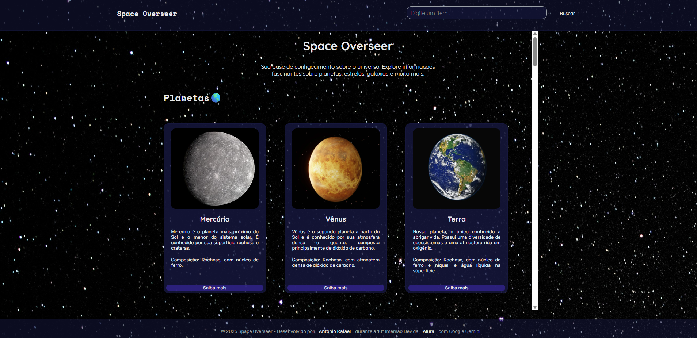

<h1 align="center">Space Overseer</h1>

Uma base de conhecimento interativa sobre corpos celestes, desenvolvida durante a décima imersão da Alura com o Google — criada com HTML, CSS e JavaScript. Este projeto apresenta informações visuais e textuais sobre estrelas, planetas, galáxias, exoplanetas, fenômenos e outros objetos do universo, organizadas para estudo e descoberta.

**Tecnologias**:
- HTML5
- CSS3
- JavaScript 

### Acesse a página do projeto [clicando aqui](https://antonio-rafael-silva.github.io/projeto-space-overseer/)

- Website - Antônio Rafael
- Linkedin - Antônio Rafael